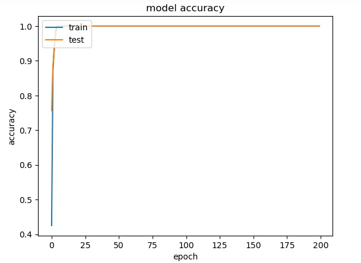
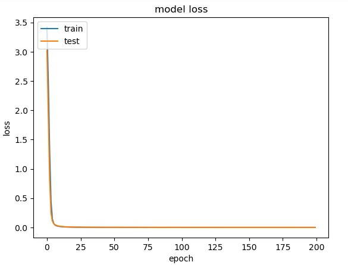

# Artificial Neural Network For Predicting Disease Based on Symptoms

### _Disclaimer_
> This is merely for personal research purposes and I, the author, am not a trained medical professional, merely a university student who is immensely curious in medical insights that could be gained through artificial intelligence. Please do not take any of the information presented here as medical advice.

## Motivation:🤔
With the increase in prominence of artificial intelligence in our daily lives, it would be interesting to explore its potential in an industry that every human needs yet not every human can afford. In countries where healthcare is more expensive, creating an inexpensive software evolution may be the answer to help bring more equality to those who have no choice but to suffer diseases due to a lack of available diagnosis and treatment.

The following project merely aims to be a starting step that demonstrates how such a concept is at the very least, plausible.

## Process of Data Analysis: 🔨

### 1. Obtaining The Data
- The raw data used was obtained from [Kaggle](https://www.fairfieldcity.nsw.gov.au/Home), and was last updated by Pranay Patil in 2020.

### 2. Cleaning The Data
- The raw data could not be fed into a neural network since the values in the columns were not numbers and the column labels were titled in a way which would be difficult to feed into the neural network.
- These issues were fixed by relabelling columns by the names of syptoms and replacing the values by 1 or 0 depending on whether a symptom was present in the specific disease diagnosis.
- This process was done in Jupyter Notebook using python since using Excel to do the task was too time consuming and tedious.

The 41 diseases used in the dataset are as follows:
>'Fungal infection', 'Allergy', 'GERD', 'Chronic cholestasis',
       'Drug Reaction', 'Peptic ulcer diseae', 'AIDS', 'Diabetes ',
       'Gastroenteritis', 'Bronchial Asthma', 'Hypertension ', 'Migraine',
       'Cervical spondylosis', 'Paralysis (brain hemorrhage)', 'Jaundice',
       'Malaria', 'Chicken pox', 'Dengue', 'Typhoid', 'hepatitis A',
       'Hepatitis B', 'Hepatitis C', 'Hepatitis D', 'Hepatitis E',
       'Alcoholic hepatitis', 'Tuberculosis', 'Common Cold', 'Pneumonia',
       'Dimorphic hemmorhoids(piles)', 'Heart attack', 'Varicose veins',
       'Hypothyroidism', 'Hyperthyroidism', 'Hypoglycemia',
       'Osteoarthristis', 'Arthritis',
       '(vertigo) Paroymsal  Positional Vertigo', 'Acne',
       'Urinary tract infection', 'Psoriasis', 'Impetigo'

## Developing The Neural Network 🧠

-  The cleaned dataset was imported to another Jupyter Notebook file where the target label i.e. the diseases were encoded into numbers since neural networks can not read strings.
-  The data was then split into training, validation and test data.
-  The neural network was then initiated with 1 input layer, 2 hidden layers (256 and 128 nodes) and 1 output layer.
-  The adam optimiser was then applied.
-  After feeding the training and validation data into the model, results for the accuracy and losses regarding the neural network could be obtained.

## Results: 💡
The model has an accuracy of aproximately 100% and losses of 0 after approximately 10 epochs as shown below:
 

## Discussion: 📖
The model's predictive capabilities appear to be high however from a practical perspective, listing out every type of symptom using columns would be quite inefficient in terms of processing time and storage space. Although it is undeniable that the quantity and precision of the data is high since 1000 cases were in the analysed data set. Furthermore it would be interesting to test the impact of including more hidden layers into the neural network as well as optimising the batch size and setting the epoch to around 10 since that appears to be where the highest accuracy is initially reached.

## Conclusion: 🧑‍🏫
This project demonstrates the significant impact artificial intelligence may have in medical applications. Having a consistent and reliable method of diagnosis that occurs rapidly and cost effectively is an encouraging next step for keen medical researchers.

Personally, I would like to further investigate the creation of a more condensed and user-friendly version of the neural network model by including NLP (Natural Language Processing) so that the labels do not need to be explicitly stated for the network to work. This project has also peaked my interest in exploring medical image analysis using CNN (Convoluted Neural Networks) as perhaps instead of typing the symptoms out, a neural network that could diagnose a condition just by looking at a patient's symptom could be quite powerful. This also applies to auditory analysis whereby a neural network can identify differences in your normal voice vs your sick voice and alert you to go see the doctor.

As you can see, the possibilities are endless. 😄

## Software Used: 🖥️

- Python 3.9
- Sci-kit learn
- Tensorflow
- Keras
- Matplotlib
- Pandas
- Numpy

## Techniques Used: 🥋

- Primary data extraction
- Data processing and cleaning
- Artificial Neural Network

## Author ✏️
>[@Raymond Shao](https://github.com/rsha0)

## References: 🔗
1. Data Science Coach, 'Neural Network for Cancer Prediction using Gene Expression Data | Python for Machine Learning', uploaded on June 8th 2022, retrieved on June 18th 2023 <https://www.youtube.com/watch?v=wtf-ALX6etk>
2. Koleck T.A. et al, 'Natural language processing of symptoms documented in free-text narratives of electronic health records: a systematic review', published online in Journal of the American Medical Informatics Association on April 2019 26(4): 364–379. doi: 10.1093/jamia/ocy173, retrieved June 20th 2023
3. Mesquita D., 'Python AI: How to Build a Neural Network & Make Predictions', publishing date unknown, retrieved on June 20th 2023: <https://realpython.com/python-ai-neural-network/>
4. Patil P., 'Disease Symptom Prediction', published in 2020, retrieved on June 20th 2023: <https://www.kaggle.com/datasets/itachi9604/disease-symptom-description-dataset>
5. Velardo V., '13 - Implementing a neural network for music genre classification', uploaded February 13th 2020, retrieved on June 20th 2023: <https://www.youtube.com/watch?v=_xcFAiufwd0>

